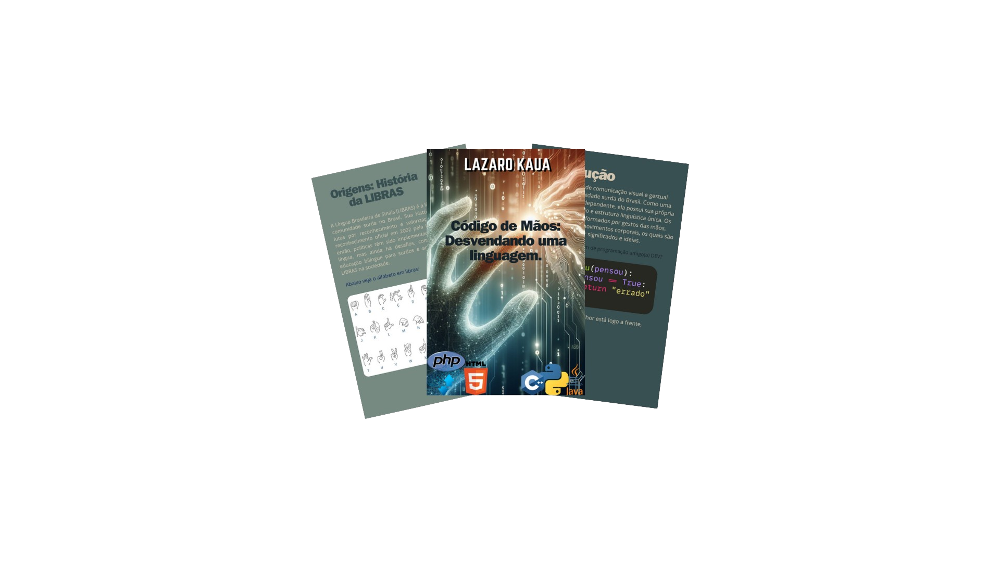

    

-------

# Projeto EBOOK Gerado por I.A.s

 > ℹ️ **NOTE:** Este é o repositório desenvolvido durante o curso no qual fui aluno na plataforma da [DIO](https://dio.me)

Projeto com o objetivo de gerar um ebook digital com as facilidades das ferramentas de IA. todos os prompts
seguem abaixo.

<a href="https://github.com/Lazarokaua/prompts-recipe-to-create-a-ebook/tree/main/output/Ebook Libras.pdf" title="View PDF now"> 📕Clique aqui para ler</a>

## 💻 Tecnologias utilizadas no projeto

- [ChatGPT](https://chat.openai.com/) 
- [Bing-images](https://www.bing.com/images/create?cc=br)
- [Canvas](https://www.canva.com/)

## 🧠 Prompts

ChatGPT：

prompt                                                                                             

User
me sugira nomes criativos para a criação de um ebook eletrônico, a ideia é criar um tema importante com uma pegada leve e descontraída, ao mesmo tempo passar as informações importantes de maneira clara e concisa.

{REGRAS}
 o nome precisa ser impactante
 o nome tem que ter trocadilho com linguagem de programação.
 ter um tema tecnologico
 e me fornecer um prompt para criar uma imagem com IA
 o ebook é sobre lingua brasileira de sinais                                                   

## ✨ Features

- Conteúdo gerado via ChatGPT
- Imagens geradas via BingImages

## 📚 Materiais

- Imagens utilizadas em `assets`
- ebook gerado em `output`

## 🛠️ Instruções de execução

Utilize os prompts acima nas ferramentas sugeridas para gerar o material base e utilize uma ferramenta de edição de documentos como power point, canvas, libreoffice , indesign para diagramação.

## 👨‍💻 Dev

    
    

    
&nbsp&nbsp&nbspLázaro kauã 
    &nbsp&nbsp&nbsp
    <a href="https://github.com/Lazarokaua">
    GitHub</a>&nbsp;|&nbsp;
    <a href="https://www.linkedin.com/in/lazaro-kaua/">LinkedIn</a>
&nbsp;|&nbsp;
    <a href="https://www.instagram.com/lazarokaua_/">
    Instagram</a>
&nbsp;|&nbsp;

  

---

⌨️ com ❤️ por [Lázaro Kauã](https://github.com/Lazarokaua)
