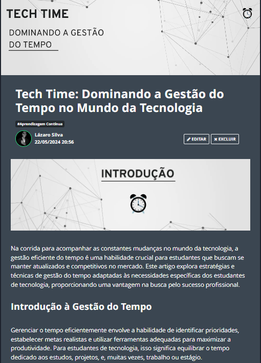

    

  
  

-------

  

# Projeto artigo técnico gerado por I.A.s

 > ℹ️ **NOTE:** Este é o repositório desenvolvido durante o curso no qual fui aluno na plataforma da [DIO](https://dio.me).

Projeto com o objetivo de gerar um artigo técnico com um layout rico, leitura agradável e com foco em promover sua autoridade técnica.

<a href="https://dio.me/articles/tech-time-dominando-a-gestao-do-tempo-no-mundo-da-tecnologia" title="View PDF now"> 📕Clique aqui para ler o artigo</a>

## 💻 Tecnologias utilizadas no projeto

- [ChatGPT](https://chat.openai.com/) - para título e conteúdo
- [Canva](https://www.canva.com) - Para formatação de banners e Layouts

## 📄 Prompts e ferramentas

ChatGPT：

|   Ação   | prompt                                                                                                                                                                                                                                                                         |
| :------: | ------------------------------------------------------------------------------------------------------------------------------------------------------------------------------------------------------------------------------------------------------------------------------ |
|  título  | Crie 10 headlines para nomes de artigos sobre o assunto Gestão do Tempo                                                                                                                                                                                                    |
| conteúdo | Olá, chat. Vamos fazer algo novo? Eu tenho uma ideia. Eu estou querendo criar um artigo, bem simples, bem introdutório, sobre gestão do tempo, só que focado... O tema vai ser gestão do tempo, só que focado para as pessoas que estudam tecnologia. Como é difícil se manter atualizado e aprender de tecnologias novas, sendo que muitas vêm surgindo e existem muitas no mercado. Essa é a principal ideia com que eu quero me basear. Você pode me ajudar? |

## ✨ Features

- Conteúdo gerado via ChatGPT

## 📚 Materiais

- prompts utilizados

## 👨‍💻 Desenvolvedor

&nbsp&nbsp&nbspLázaro kauã 
    &nbsp&nbsp&nbsp
    <a href="https://github.com/Lazarokaua">
    GitHub</a>&nbsp;|&nbsp;
    <a href="https://www.linkedin.com/in/lazaro-kaua/">LinkedIn</a>
&nbsp;|&nbsp;

---
## 👨‍💻 Mentor

 
[Felipe Aguiar](https://github.com/felipeAguiarCode)
